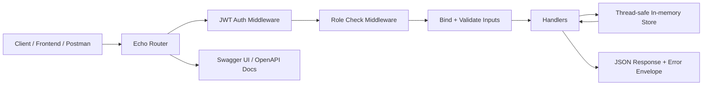

# ZORVYN-Finance-Backend
Zorvyn finance dashboard backend with JWT auth, role-based access control, financial records CRUD, dashboard analytics, validation, and Swagger docs.
=======
# Zorvyn — Finance Data Processing & Access Control Backend

A backend API for a multi-role finance dashboard system built with **Go** and the **Echo** framework. It supports financial record management, role-based access control, dashboard analytics, and JWT authentication — all backed by a thread-safe in-memory store.

---

## Architecture Overview



### End-to-End Flow

1. A user logs in with email and password.
2. The API validates credentials and returns a JWT token.
3. The token is sent on protected requests using `Authorization: Bearer <token>`.
4. Auth middleware validates the token, checks revocation, and loads the current user.
5. RBAC middleware allows or denies the request based on the user's role.
6. Handlers validate inputs, apply business rules, and call the store layer.
7. The store updates or reads users and financial records in a thread-safe way.
8. Dashboard handlers aggregate totals, category breakdowns, recent records, and trends.
9. Errors are returned in a consistent JSON format with status codes and error codes.

---

## Tech Stack

| Concern        | Choice                              |
|----------------|-------------------------------------|
| Language       | Go 1.24                             |
| Framework      | Echo v4                             |
| Auth           | JWT (golang-jwt/jwt v5)             |
| Passwords      | bcrypt (golang.org/x/crypto)        |
| Validation     | go-playground/validator v10         |
| API Docs       | Swagger UI (swaggo/echo-swagger)    |
| Persistence    | In-memory (thread-safe, sync.RWMutex) |
| IDs            | UUID v4 (google/uuid)               |

---

## What Is Implemented

- User and role management with active/inactive users
- JWT authentication with logout token revocation
- Role-based access control for viewer, analyst, and admin
- Financial records CRUD
- Record filtering by type, category, date range, and search
- Dashboard summary APIs with totals, net balance, recent activity, and trends
- Validation and consistent structured error responses
- Swagger documentation generated from annotations
- Thread-safe persistence using an in-memory store

---

## Quick Start

```bash
git clone <repo-url>
cd zorvyn
go run main.go
```

Server starts at `http://localhost:8080`
Swagger UI at `http://localhost:8080/swagger/index.html`

### Smoke Test Flow

To verify the system end to end:

1. Log in as `admin@zorvyn.io`, `analyst@zorvyn.io`, and `viewer@zorvyn.io`.
2. Confirm each token works with `/api/v1/auth/me`.
3. Confirm dashboard routes are accessible to all roles.
4. Confirm records routes are blocked for viewer and allowed for analyst/admin as designed.
5. Confirm user management routes are admin-only.
6. Confirm logout revokes the token.

---

## Pre-seeded Dummy Credentials

| Email                  | Password     | Role     |
|------------------------|--------------|----------|
| admin@zorvyn.io        | Admin@123    | admin    |
| analyst@zorvyn.io      | Analyst@123  | analyst  |
| viewer@zorvyn.io       | Viewer@123   | viewer   |

17 financial records across 3 months are pre-loaded covering salary, rent, utilities, freelance, consulting, investment, travel, marketing, and office supplies.

---

## Project Structure

```text
zorvyn/
├── main.go                      # Server bootstrap, routes, seed data
├── docs/                        # Generated Swagger files
└── internal/
  ├── models/models.go         # Domain models + DTOs
  ├── store/store.go           # Thread-safe in-memory data store
  ├── middleware/auth.go       # JWT auth, RBAC, rate limiting
  └── handlers/
    ├── auth.go              # Login, logout, /me
    ├── users.go             # User CRUD
    ├── records.go           # Financial record CRUD + filters
    ├── dashboard.go         # Summary + weekly trends
    └── helpers.go           # Shared bind/validate, error helpers
```

---

## Role Permissions

| Action                        | Viewer | Analyst | Admin |
|-------------------------------|--------|---------|-------|
| Login / Logout / Me           | ✅     | ✅      | ✅    |
| View records (list/get)       | ❌     | ✅      | ✅    |
| Create / Update records       | ❌     | ✅      | ✅    |
| Delete records (soft)         | ❌     | ❌      | ✅    |
| View dashboard summary        | ✅     | ✅      | ✅    |
| View weekly trends            | ✅     | ✅      | ✅    |
| Manage users (CRUD)           | ❌     | ❌      | ✅    |

---

## Request Lifecycle Details

### Authentication

- Login validates credentials and returns a signed JWT.
- Protected routes require the token in the `Authorization` header.
- Logout revokes the current token using an in-memory blocklist.

### Authorization

- Viewer: dashboard-only access.
- Analyst: dashboard + records read/write.
- Admin: full access, including user management and record deletion.

### Validation and Errors

- Request bodies are bound and validated with `go-playground/validator`.
- Invalid queries return structured error codes such as `INVALID_QUERY` and `INVALID_DATE`.
- All errors return a JSON envelope with `code` and `message`.

### Data Flow

- Handlers operate on DTOs and domain models.
- Store methods encapsulate user, record, and token state.
- Dashboard summaries are calculated from active records at request time.

---

## API Reference

### Authentication

| Method | Endpoint           | Description                        |
|--------|--------------------|------------------------------------|
| POST   | /api/v1/auth/login | Login, returns JWT token           |
| POST   | /api/v1/auth/logout| Revoke current token               |
| GET    | /api/v1/auth/me    | Get current user profile           |

### Users (Admin only)

| Method | Endpoint           | Description                        |
|--------|--------------------|------------------------------------|
| GET    | /api/v1/users      | List all users                     |
| GET    | /api/v1/users/:id  | Get user by ID                     |
| POST   | /api/v1/users      | Create new user                    |
| PUT    | /api/v1/users/:id  | Update name, role, or active status|
| DELETE | /api/v1/users/:id  | Permanently delete user            |

### Financial Records

| Method | Endpoint             | Roles              | Description                     |
|--------|----------------------|--------------------|---------------------------------|
| GET    | /api/v1/records      | analyst, admin     | List with filters + pagination  |
| GET    | /api/v1/records/:id  | analyst, admin     | Get single record               |
| POST   | /api/v1/records      | analyst, admin     | Create record                   |
| PUT    | /api/v1/records/:id  | analyst, admin     | Update record (partial)         |
| DELETE | /api/v1/records/:id  | admin              | Soft delete record              |

**Record list query params:**

| Param    | Type   | Description                                      |
|----------|--------|--------------------------------------------------|
| type     | string | `income` or `expense`                            |
| category | string | Case-insensitive exact match                     |
| search   | string | Free-text search in category + description       |
| from     | string | Start date (RFC3339, e.g. `2026-03-01T00:00:00Z`)|
| to       | string | End date (RFC3339)                               |
| page     | int    | Page number (default: 1)                         |
| limit    | int    | Page size, max 100 (default: 20)                 |

Validation notes:
- `type` must be `income` or `expense`.
- `page` and `limit` must be integers.
- `from` must be less than or equal to `to` when both are provided.
- Viewer accounts cannot access this endpoint.

### Dashboard

| Method | Endpoint                  | Roles              | Description                          |
|--------|---------------------------|--------------------|--------------------------------------|
| GET    | /api/v1/dashboard/summary | all                | Totals, category breakdown, trends   |
| GET    | /api/v1/dashboard/weekly  | all                | Weekly income/expense for 12 weeks   |

Dashboard responses include:
- Total income
- Total expenses
- Net balance
- Category-wise totals
- Recent records
- Monthly trends
- Weekly trends with zero-filled missing weeks

---

## Error Response Format

All errors return a consistent JSON envelope:

```json
{
  "code": "NOT_FOUND",
  "message": "record not found"
}
```

Common error codes: `MISSING_TOKEN`, `INVALID_TOKEN`, `TOKEN_REVOKED`, `USER_INACTIVE`, `FORBIDDEN`, `NOT_FOUND`, `EMAIL_EXISTS`, `VALIDATION_ERROR`, `RATE_LIMITED`.

---

## Features Implemented

- ✅ JWT authentication with 24-hour expiry
- ✅ Token revocation (logout blocklist)
- ✅ Role-based access control (viewer / analyst / admin)
- ✅ Financial records CRUD
- ✅ Soft delete (records hidden, not destroyed)
- ✅ Filtering by type, category, date range
- ✅ Free-text search across category and description
- ✅ Pagination with total pages in response
- ✅ Dashboard: totals, net balance, category breakdown, recent activity
- ✅ Monthly trends aggregation
- ✅ Weekly trends aggregation (last 12 weeks)
- ✅ Weekly trends always return 12 buckets (missing weeks are zero-filled)
- ✅ Input validation with descriptive errors
- ✅ Structured error responses with error codes
- ✅ Rate limiting (50 req/s, burst 100)
- ✅ CORS enabled
- ✅ Swagger UI with full annotations and dummy data descriptions
- ✅ Thread-safe concurrent access (sync.RWMutex)
- ✅ Password hashing with bcrypt

---

## Verification

The following was verified during development:

- Login for admin, analyst, and viewer
- RBAC on dashboard, records, and users endpoints
- Logout token revocation
- Filtered record listing
- Record creation, update, and soft delete behavior
- Dashboard summary and weekly trend aggregation
- `go test ./...`
- Swagger regeneration

---

## Assumptions & Tradeoffs

1. **In-memory storage**: Data resets on server restart. This was chosen per the assignment's allowance for simplified persistence. Swapping to a real DB (e.g. SQLite, PostgreSQL) would only require replacing the `store` package — all handler and middleware logic remains unchanged.

2. **Token blocklist is in-memory**: Revoked tokens are stored in the same in-memory map. In production this would use Redis with TTL matching the token expiry.

3. **Viewer dashboard access**: The assignment states "viewer can only view dashboard data" — this was interpreted as viewers having read access to the dashboard summary and weekly trends, but no access to record endpoints.

4. **Soft delete only for records**: Records are never permanently removed to preserve audit history. Users are hard-deleted since they are administrative entities.

5. **Rate limiting is global**: A single server-wide limiter is used for simplicity. Per-IP or per-user limiting would be more appropriate in production.

6. **No refresh tokens**: The JWT is valid for 24 hours. Refresh token rotation was omitted to keep the implementation focused.
